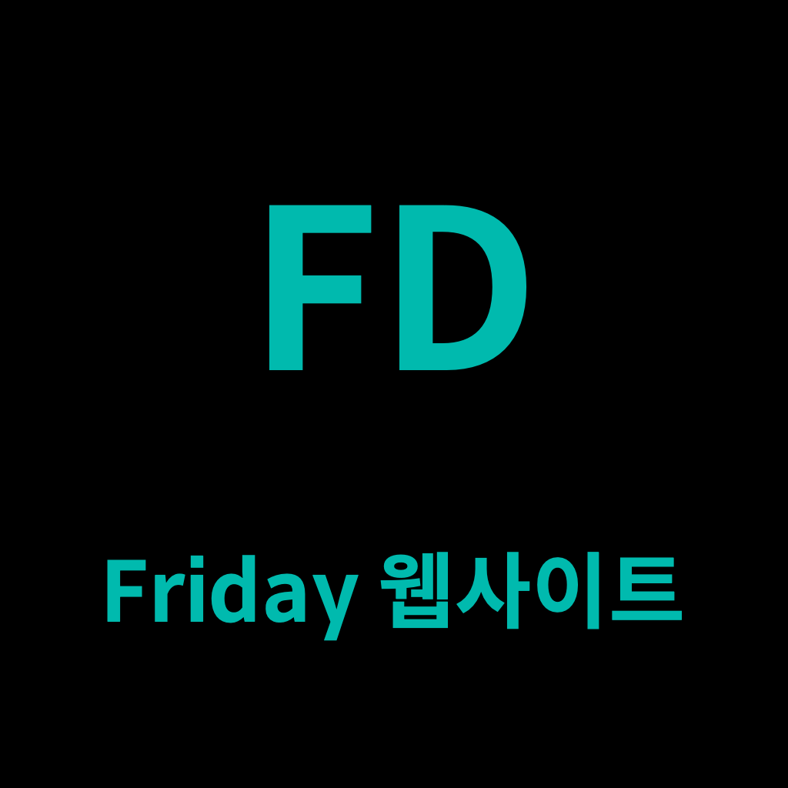

# 프로젝트 이름 및 소개
  
<b>FD Web</b> : FRIDAY의 대표 홈페이지 제작 (링크: https://www.fridayproject.co.kr/)  

## ⏰ 개발 기간

개발기간 : 2022년 3월 25일 ~ 2022년 8월 25일  

## 👩‍💻 멤버 구성

- Developer 
  Leader: 장재균  
  Member: 김동연, 서지호, 송승환, 송진영  
- Design 
  Member: 김민아   
  
## 사용한 프레임워크

- FE : <b> React.js</b> 
  
 

## Next.js 도입 (2023.03.08)
+ ~~Github Action을 이용한 CI/CD는 임시 비활성화해둔 상태입니다.~~(2023.04.29 적용)
+ Next.js는 라우팅을 기본으로 지원합니다. 각 화면에 대한 코드는 `pages` 폴더로 이동하였습니다.
+ 관련 추가 내용은 [#39](https://github.com/ProjectFRIDAY/FD_Web/pull/39)를 참고해주세요.  

## 배포 방식 변경 (AWS EC2 → Vercel) (2023.04.29)
+ AWS 프리티어 종료일 임박 이슈로 배포 방식을 변경하였습니다.
+ Private한 설정 및 정보는 FD Web 노션을 참고해주세요.
